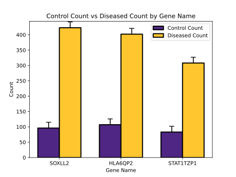

<script src="files/additional.js" type="text/javascript"></script>

::::::::::::::::::::::::::::::::::::::: objectives

- use your accumulated experience to analyze a data set

::::::::::::::::::::::::::::::::::::::::::::::::::

:::::::::::::::::::::::::::::::::::::::: questions

- How do i analyze data using python?

::::::::::::::::::::::::::::::::::::::::::::::::::


:::::::::::::::::::::::::::::::::::::::::  callout

## Note

This task is simplified for learning purposes. Real RNA sequencing analysis involves more complex steps, but the goal 
here is to practice essential data manipulation and visualization skills. Synaptoperitis is a fictional disease, and 
all gene names and data in this exercise are entirely fictional, designed solely for learning purposes. For some 
subtasks you  will need to refer to Python documentation or conduct web reviews which is also a major part of real 
life data science / coding.*

::::::::::::::::::::::::::::::::::::::::::::::::::


In this exercise, you’re joining a research team (2 people) with a critical mission: to identify a potential key gene in the progression of the fictional disease Synaptoperitis! Your findings in this fictional dataset could theoretically guide the next steps toward therapy development (if this disease were real!).

#### Background:

Synaptoperitis is a fictional neurodegenerative disorder characterized by the progressive deterioration of synaptic function, leading to cognitive decline and motor impairment. Symptoms may include memory loss, difficulties in coordination, and changes in mood or behavior. The exact mechanisms underlying Synaptoperitis remain largely unknown, but it is believed that certain genes may be involved in the regulation of synaptic health and neurotransmitter balance. 
<br/><br/>
The team has collected RNA data from "healthy" and "diseased" brain tissue from a mouse model of the disease to identify which genes are upregulated, hypothesizing that some of those could play a crucial role in disease progression. Through your data analysis, you will search for these significantly upregulated genes and identify a primary target for hypothetical therapies.

#### Your Research Tasks:

- Task 1: Load the fictional count data for control and diseased tissue as well as the pseudogene_mapping and familiarize yourself with the data.

- Task 2: Review the expression counts for a gene of interest suggested by the team (AKT7LA1) in healthy vs. diseased tissues.

- Task 3: Calculate the fold-change upregulation for each gene in diseased tissue compared to healthy tissue.

- Task 4: Identify genes that are upregulated at least 2-fold and rank them to determine the top candidates.

- Task 5: Visualize the highest-upregulated gene with a bar plot comparing its counts in healthy vs. diseased samples.


### Awards:

- **Groundbreaking Research**: The team that completes all tasks correctly in the shortest time.

- **Best Science Illustration**: Team with the prettiest bar plot (voted by all teams).


:::::::::::::::::::::::::::::::::::::::  challenge

## Download the Data

Download <a href=files/combined_counts.csv download>combined_counts.csv</a> and
<a href=files/pseudogene_mapping.csv> pseudogene_mapping.csv</a> and place them alongside a new notebook

::::::::::::::::::::::::::::::::::::::::::::::::::


:::::::::::::::::::::::::::::::::::::::  challenge

## Pre-requisites

- In this task, you will need the pandas as well as the matplotlib library.

- **Your solution should include the following steps:**
    - Import both packages.


:::::::::::::::  solution

## Solution

```python
import matplotlib.pyplot as plt
import pandas as pd
```

:::::::::::::::::::::::::

::::::::::::::::::::::::::::::::::::::::::::::::::


:::::::::::::::::::::::::::::::::::::::  challenge

## Load and inspect the pseudogene_mappings and counts


- Import the *"pseudogene_mapping.csv"* and the *"combined_counts.csv"* as you did for CSV files previously. 

- Familiarize yourself with the structure and  content of both dataframes. 

- **Your solution should include the following steps:**
    - Import both files as dataframes.
    - Review the content of both dataframes.


:::::::::::::::  solution

## Solution

```python
mapping = pd.read_csv("pseudogene_mapping.csv")
counts = pd.read_csv("combined_counts.csv")
print(mapping.head())
print(counts.head())
```

:::::::::::::::::::::::::

::::::::::::::::::::::::::::::::::::::::::::::::::


:::::::::::::::::::::::::::::::::::::::  challenge

## Infer a potential role of AKT7LA1 


- Literature reviews suggest that the gene **AKT7LA1** plays a role in the progression of **Synaptoperitis**. Before you proceed with your analysis, take a quick look at the counts for AKT7LA1 in the dataset.

- You may have noticed that the sequencing company sent you the count table with Ensemble IDs rather than gene names. However, you have also loaded a dataframe containing the gene names corresponding to each Ensemble ID. Thus, you will first need to merge both dataframes based on the shared column you identified in Task 1.
<br/><br/>

- **Tip 1**:  The `df.merge()` method may be helpful here: (https://pandas.pydata.org/docs/reference/api/pandas.merge.html).

- **Tip 2**:  Use the `df.set_index()` function to set "Gene_Name" as the new index after merging, so you can select entries by gene name similarly to how we did in the workshop previously:(https://pandas.pydata.org/docs/reference/api/pandas.DataFrame.set_index.html).
<br/><br/>

- **Your solution should include the following steps:**
    - Create a merged dataframe that contains Gene_Names (as the index) as well as the Pseudogene_ID and Diseased_Count columns.


:::::::::::::::  solution

## Solution

```python
df = pd.merge(mapping, counts, left_on="Pseudogene_ID", right_on="Pseudogene_ID")
df = df.set_index("Gene_Name")
df.loc["AKT7LA1"]
```

:::::::::::::::::::::::::

::::::::::::::::::::::::::::::::::::::::::::::::::


:::::::::::::::::::::::::::::::::::::::  challenge

## Calculate the fold-change upregulation for each gene

- Next, you want to determine how much each gene is upregulated in the diseased tissue versus the control tissue. To do this, add a column called *"Fold_Change"* to your dataframe.

- **Tip 1**: You can create a new column in a dataframe using the syntax `df["new_column"] = XYZ`.

- **Tip 2**: You can perform computations with entire columns of a dataframe. 
<br/><br/>

- **Your solution should include the following steps:**
    - The merged dataframe created in Task 2 should now include the column **Fold_Change**, which contains the upregulation values for each gene in the diseased tissue sample.
    

:::::::::::::::  solution

## Solution

```python
df["Fold_Change"] = df["Diseased_Count"] / df["Control_Count"]
df.head()
```

:::::::::::::::::::::::::

::::::::::::::::::::::::::::::::::::::::::::::::::


:::::::::::::::::::::::::::::::::::::::  challenge

## Identify genes with at least 2-fold upregulation and extract top candidates.

- In this task, you will infer potential disease-relevant genes from the dataset. Your goal is to identify genes that are upregulated by at least 2-fold in the diseased tissue.

- **Tip 1:** To learn how to subset entries in a DataFrame based on a condition, refer to: https://pandas.pydata.org/docs/getting_started/intro_tutorials/03_subset_data.html

- **Tip 2:** You have already learned different ways to sort lists. You can sort a dataframe based on a certain column by using the `df.sort_values()` method: https://pandas.pydata.org/docs/reference/api/pandas.DataFrame.sort_values.html
<br/><br/>

- **Your solution should include the following steps:**
    - Subset the genes that meet this criterion to create a new DataFrame.
    - Sort this new DataFrame in descending order based on fold-change.
    - Save the new dataframe as `.csv` file.
    - How many genes are upregulated by at least 2-fold?


:::::::::::::::  solution

## Solution

```python
two_fold = df[df["Fold_Change"] >= 2]
two_fold = two_fold.sort_values("Fold_Change", ascending=False)
two_fold.to_csv("Synaptoperitis_at_least_two_fold.csv") # This saves the detected candidates to csv
num_two_fold_genes = len(two_fold)
num_two_fold_genes
```

```output
489
```

:::::::::::::::::::::::::

::::::::::::::::::::::::::::::::::::::::::::::::::


:::::::::::::::::::::::::::::::::::::::  challenge

## Visualize the highest-upregulated gene with a bar plot comparing its counts in healthy vs. diseased samples

- After creating a sorted list of the upregulated genes in the dataset, you want to identify the genes with the highest upregulation in diseased tissue to find potential targets for therapy. 

- Next month, you will attend an important meeting called *Hallmarks of Synaptoperitis Progression 2024* which takes place in a conference center near Hamburg. For this meeting you want to create barplot showing  the control vs. diseased tissue counts for the three top upregulated genes to discuss them with your peers at your next lab meeting.

- **Tip 1:** You have already sorted your list by descending fold-change. Do you remember how to select dataframe entries based on their position in the dataframe?
- **Tip 2:** There is an extra barplot function in the `matplotlib` library called, .bar (https://matplotlib.org/stable/api/_as_gen/matplotlib.pyplot.bar.html)

- **Your solution should include the following steps:**
    - Identify the 3 genes with the highest fold-change in the diseased tissue.
    - Generate a bar plot for each of these genes, presenting the counts for the control vs. diseased tissue.

:::::::::::::::  solution

## Solution

```python
import numpy as np
top_3 = two_fold.iloc[:3]
x = np.arange(len(top_3))  # Label locations
width = 0.35
fig, ax = plt.subplots()
bars1 = ax.bar(x - width/2, top_3['Control_Count'], width, label='Control Count', color="#4F2683",  edgecolor="black", linewidth=2)
bars2 = ax.bar(x + width/2, top_3['Diseased_Count'], width, label='Diseased Count', color='#FFC62F',  edgecolor="black", linewidth=2)

# Add labels, title, and legend
ax.set_xlabel('Gene Name')
ax.set_ylabel('Count')
ax.set_title('Control Count vs Diseased Count by Gene Name')
ax.set_xticks(x)
ax.set_xticklabels(top_3.index)
ax.legend()

# Make sure to add some "error bars" to make it look more scientific
for rect in bars1 + bars2:
    height = rect.get_height() - 5
    plt.text(rect.get_x() + rect.get_width() / 2.0, height, f'T', ha='center', va='bottom', fontdict=dict(size=16))
# Display plot
plt.show()
```

{alt='Correlations Solution 1'}


:::::::::::::::::::::::::

::::::::::::::::::::::::::::::::::::::::::::::::::


:::::::::::::::::::::::::::::::::::::::: keypoints

- Solve tasks using python

::::::::::::::::::::::::::::::::::::::::::::::::::


